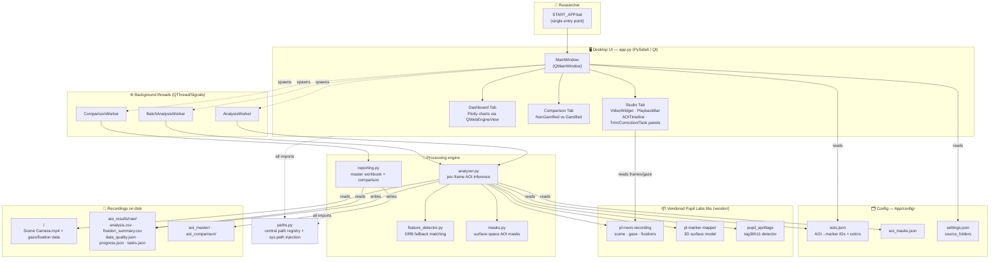
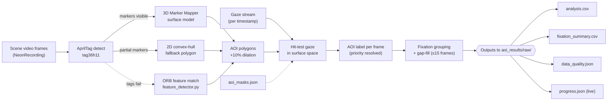
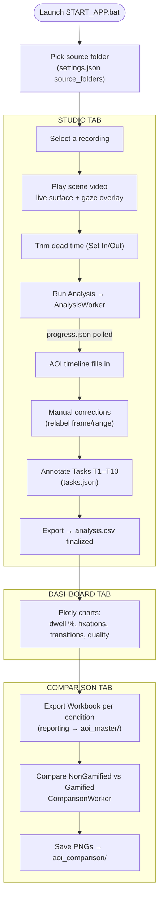
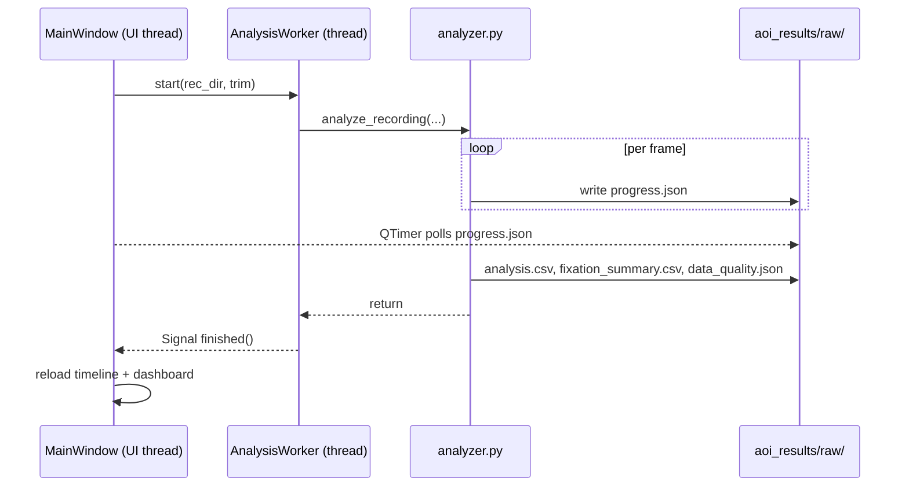

# AOI Studio — System Design

Visual architecture for the Pupil Labs AOI analysis desktop app (THOWL gamification experiment).
All diagrams are **Mermaid** — they render in VS Code (Markdown preview) and on GitHub. Paste any
block into <https://mermaid.live> to export PNG/SVG.

---

## 1. Layered architecture (components & responsibilities)

---

## 2. Analysis data pipeline (`analyzer.analyze_recording`)

---

## 3. User workflow across the three tabs

---

## 4. Threading & live-progress model

---

### How to view
- **VS Code:** open this file, `Ctrl+Shift+V` for Markdown preview (install *Markdown Preview Mermaid Support* if blocks don't render).
- **GitHub:** renders automatically on push.
- **Export image:** copy a block into <https://mermaid.live> → Actions → PNG/SVG.
